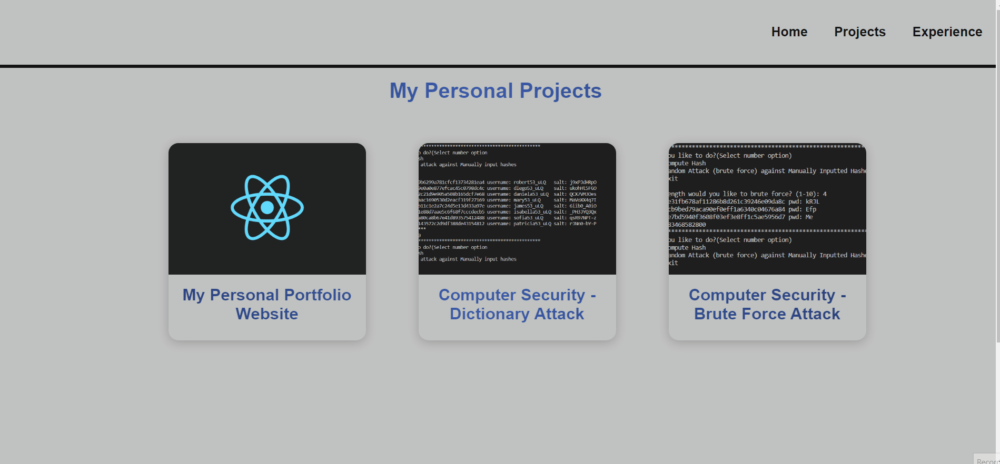

# Personal Portfolio Website
_Built with ReactJS

## About
This project is a personal portfolio I built myself to show case skills in React and upload other projects.

I began the project when I had the idea to create a website/blog to upload information about myself when I figured I'd learn ReactJS so I could understand and learn the library better. I originally began working on the project in this repo: https://github.com/rvasquez25/rosendos-personal-portfolio  but initially created the folders wrong and ran into issues on Netlify so I copied the files over to this repo.

My favorite part of the portfolio was creating the projects section. I followed a tutorial by PedroTech on Youtube and creating the pages with ID's was at first a complex concept to me but, once I created it, I understood how to map my project better using indexes. I'll continue working and improving on the website (such as adding a blog section and back-end services) but for now, I have enjoyed learning the basics of ReactJS and being able to bring my portfolio to life.

## Demo
<a href="https://flourishing-macaron-51d1a5.netlify.app/" target="new">Live website</a>

**Home Page**

**Projects and Project Display Pages**

**Experience**

